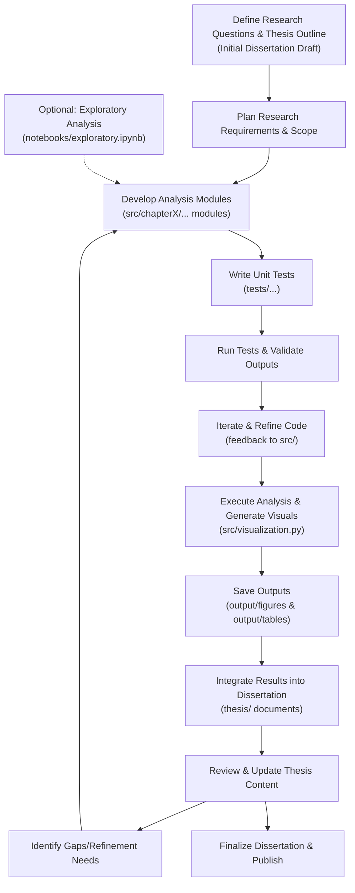

# Project Structure

```
project/
├── README.md              # Project Overview & Thesis Correspondence
├── requirements.txt       # List of all Python package dependencies
├── setup.py               # Project packaging and installation configuration
│
├── data/                  # Data directory
│   ├── raw/               # Raw data: allusion texts, annotations, original XML, etc.
│   └── processed/         # Processed data: formatted TEI-XML/JSON for analysis
│
├── output/                # Automatically generated outputs
│   ├── tables/            # Automatically generated tables with analysis results
│   └── figures/           # Visualization results (charts, knowledge graphs, etc.)
│
├── thesis/                # Dissertation and related documents
│   ├── chapter1.md
│   ├── chapter2.md
│   ├── chapter3.md
│   ├── chapter4.md
│   ├── chapter5.md
│   ├── chapter6.md
│   └── chapter7.md
│
├── notebooks/             # Jupyter notebooks for exploratory analysis
│   └── exploratory.ipynb
│
├── src/                   # Main project source code
│   ├── __init__.py
│   ├── main.py
│   ├── config.py
│   ├── chapter1/
│   │       ├── data_processing.py
│   │       └── methods.py
│   ├── chapter2/
│   │       ├── knowledge_graph.py
│   │       └── format_design.py
│   ├── chapter3/
│   │       ├── syntactic_analysis.py
│   │       └── pos_conversion.py
│   ├── chapter4/
│   │       ├── paragraph_analysis.py
│   │       └── rhetorical_analysis.py
│   ├── chapter5/
│   │       ├── discourse_analysis.py
│   │       └── integration.py
│   ├── chapter6/
│   │       ├── semantic_drift.py
│   │       └── context_transformation.py
│   ├── chapter7/
│   │       └── conclusion.py
│   └── visualization.py
│
└── tests/                 # Unit tests ensuring module functionality
    ├── test_chapter1.py
    ├── test_chapter2.py
    ├── test_chapter3.py
    ├── test_chapter4.py
    ├── test_chapter5.py
    ├── test_chapter6.py
    └── test_visualization.py

```

# Arrangement Explanation



# Project Documentation & Dissertation Correspondence

This document details the module division, correspondence with dissertation chapters, and the overall workflow of the project, all aligned with the revised project structure.

---

## 1. Module Division and Correspondence with Thesis Chapters

- **Chapter 1: Research Methods & Data Processing**
  - **src/chapter1/data_processing.py**  
    Corresponds to the research methodology and data sources outlined in Chapter 1. This module handles data collection, cleaning, and format conversion (TEI-XML/JSON), ensuring that subsequent analysis receives a consistent and standardized input.
  - **src/chapter1/methods.py**  
    Defines the research scope and methodological framework used in Chapter 1, including the rationale for data collection and preprocessing steps.

- **Chapter 2: Knowledge Graph Construction & Format Design**
  - **src/chapter2/knowledge_graph.py**  
    Based on Chapter 2, this module constructs the knowledge graph of allusions, performing node classification and relationship design.
  - **src/chapter2/format_design.py**  
    Handles the design of semantic fields and creates interfaces for converting data into interoperable formats (XML/JSON), which supports both analysis and visualization.

- **Chapter 3: Syntactic Analysis**
  - **src/chapter3/syntactic_analysis.py**  
    In accordance with Chapter 3, this module analyzes the syntactic roles and dependency structures of allusions within sentences.
  - **src/chapter3/pos_conversion.py**  
    Focuses on part-of-speech conversions and detailed handling of syntactic transformations pertinent to the analysis.

- **Chapter 4: Paragraph-Level Analysis & Rhetorical Functions**
  - **src/chapter4/paragraph_analysis.py**  
    Corresponds to Chapter 4 by analyzing allusion density and identifying semantic themes at the paragraph level.
  - **src/chapter4/rhetorical_analysis.py**  
    Explores the rhetorical and pragmatic functions of allusions within paragraphs, enhancing the understanding of stylistic devices.

- **Chapter 5: Discourse-Level Analysis**
  - **src/chapter5/discourse_analysis.py**  
    Derived from Chapter 5’s discourse structure analysis, this module investigates how allusions are linked and interact within the larger text, both internally and with external references.
  - **src/chapter5/integration.py**  
    Focuses on integrating the internal/external allusion relationships and mapping textual responses, ensuring a cohesive interpretation of discourse.

- **Chapter 6: Semantic Drift in Allusions**
  - **src/chapter6/semantic_drift.py**  
    In Chapter 6, this module focuses on allusion substitutions, context transformations, and the semantic drifts observed in thematically similar works.
  - **src/chapter6/context_transformation.py**  
    Deals with analyzing how contextual shifts result in semantic reconfiguration, critical for understanding the drift phenomena.

- **Chapter 7: Conclusion**
  - **src/chapter7/conclusion.py**  
    Represents the concluding chapter, summarizing the research findings, integrating the various analytical approaches, and discussing future prospects.

- **Visualization Across the Project**
  - **src/visualization.py**  
    This module centrally manages all visualization requirements. It generates knowledge graphs, statistical charts, and other visual outputs, saving them automatically to the `output/figures` directory, while any tabulated analysis results are stored in `output/tables`. These outputs are later integrated into the final dissertation documents housed in the `thesis/` folder.

---

## 2. Simplicity of Structure and Maintainability

- **Clear Layering**  
  The project is organized into distinct directories:
  - **data/** holds raw and processed datasets.
  - **src/** contains all core source code, divided into chapter-specific modules.
  - **thesis/** stores the dissertation documents.
  - **output/** is reserved for auto-generated figures and tables.
  - **notebooks/** provides space for exploratory analysis.
  - **tests/** contains unit tests.
  
  This separation aligns with best practices, ensuring that modifications in one area do not interfere with others.

- **Modular Design**  
  Each analysis module is compartmentalized within its corresponding chapter folder under **src/** (e.g., `src/chapter1/`, `src/chapter2/`, etc.), mirroring the dissertation chapters. This design not only covers all stages of the research but also facilitates future expansion or modifications as your study evolves.

- **Unit Testing**  
  A dedicated **tests/** folder contains unit tests for each module (e.g., `test_chapter1.py`, `test_chapter2.py`, etc.), promoting robust continuous integration. This ensures that every change is verified for functionality, which helps maintain the long-term stability and quality of the project.

- **Output Integration**  
  The **output/** directory—with subdirectories for **figures** and **tables**—centralizes all auto-generated visual content and statistical output. This arrangement supports an automated workflow where the latest graphs and tables are always embedded into the final dissertation, streamlining updates and reducing manual intervention.

- **Configuration and Documentation**  
  The **config.py** file, along with comprehensive documentation stored in the **thesis/** folder, provides centralized configuration parameters and detailed explanations of the methodology. This makes the project straightforward to understand, configure, and align with the overall dissertation content.

---

## 3. Arrangement Explanation

### Main Flow

- **Entry Point**:  
  `main.py` serves as the entry point. It first loads all configuration parameters from `config.py`.

- **Data Ingestion and Processing**:  
  Raw data is loaded from the `data/raw` directory, then cleaned and transformed using `src/chapter1/data_processing.py`. The processed data is stored in `data/processed`.

- **Chapter-Specific Analysis**:  
  The processed data is subsequently analyzed by modules organized by dissertation chapters (from **Chapter 1** through **Chapter 7** in the **src/** directory). Each chapter module is responsible for a specific aspect of the research, ensuring a focused and comprehensive analysis.

- **Visualization and Output Generation**:  
  The analysis results are passed to `src/visualization.py`, which consolidates them into visual outputs (such as knowledge graphs and charts). These visual assets are automatically saved in `output/figures` and any tabular data is stored in `output/tables`.

- **Dissertation Integration**:  
  Finally, the auto-generated visual outputs and tables are programmatically integrated into the dissertation documents stored in the `thesis/` folder. This ensures that your dissertation always reflects the latest analytical results.

### Additional Components

- **Unit Testing**:  
  The **tests/** directory contains unit tests for each module, ensuring that every part of the analysis functions correctly. This automation supports continuous integration and helps maintain code quality.

- **Exploratory Analysis**:  
  The **notebooks/** folder houses Jupyter Notebooks for interactive exploration and experimentation, providing an additional platform for refining your analysis before final integration.
