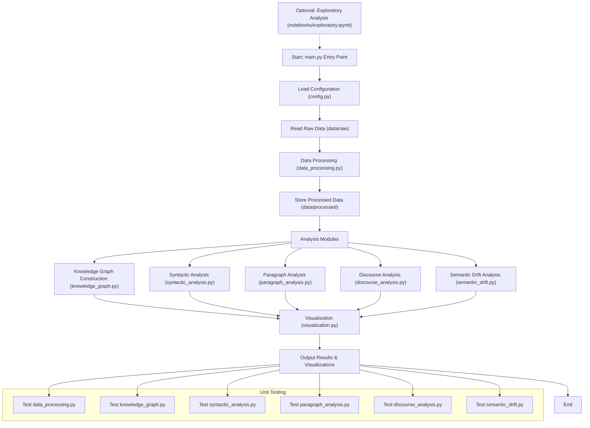

# Project Structure

```
thesis-repo/
├── README.md              # Project Overview, User Guide, and Environment Setup
├── requirements.txt       # List of all Python package dependencies
├── setup.py               # Setup script for packaging and installation configuration
│
├── data/                  # Data-related folder
│   ├── raw/               # Raw data sources: allusion texts, annotations, original XML, etc.
│   └── processed/         # Processed data: TEI-XML/JSON formatted data for subsequent analysis
│
├── docs/                  # Documentation: Comprehensive Dissertation and Supplementary Appendices
│   └── dissertation.md    # Complete Dissertation Document Detailing Thesis Objectives, Methodology, and Findings
│
├── notebooks/             # Jupyter notebooks for exploratory analysis and rapid experiments
│   └── exploratory.ipynb
│
├── src/                   # Main project source code
│   ├── __init__.py
│   ├── main.py            # Main entry point, integrates various modules to control the workflow
│   ├── config.py          # Configuration file for centralized management of paths, parameters, constants, etc.
│   ├── data_processing.py # Data collection, cleaning, and format conversion (e.g., XML and JSON interfaces)
│   ├── knowledge_graph.py # Construction of the allusion knowledge graph: node classification, relationship design, and visualization (corresponds to Chapter 2)
│   ├── syntactic_analysis.py  
│   │     # Analysis of allusion syntactic roles, dependency parsing, and part-of-speech conversion (corresponds to Chapter 3)
│   ├── paragraph_analysis.py  
│   │     # Analysis of allusion density at the paragraph level, thematic elements, and rhetorical functions (corresponds to Chapter 4)
│   ├── discourse_analysis.py  
│   │     # Analysis of allusion presentation within discourse structures, internal and external allusion relationships, and responsiveness (corresponds to Chapter 5)
│   ├── semantic_drift.py  
│   │     # Analysis of allusion substitution, context transformation, and semantic drift in works on the same subject (corresponds to Chapter 6)
│   └── visualization.py   # Implementation of static and interactive visualizations: knowledge graphs and statistical charts
│
└── tests/                 # Unit tests to ensure the functionality of each module
    ├── test_data_processing.py
    ├── test_knowledge_graph.py
    ├── test_syntactic_analysis.py
    ├── test_paragraph_analysis.py
    ├── test_discourse_analysis.py
    └── test_semantic_drift.py

```

  # Arrangement Explanation



1. Module Division and Correspondence with Thesis Chapters

* data_processing.py: Corresponds to the research methodology and data sources in Chapter 1. It handles data collection, cleaning, and format conversion (TEI-XML/JSON), ensuring a consistent and standardized input for subsequent analysis.

* knowledge_graph.py: Based on the content of Chapter 2, it constructs the knowledge graph of allusions. This module performs node classification and relationship design while providing visualization interfaces.

* syntactic_analysis.py: In accordance with Chapter 3, it analyzes the syntactic roles, dependency structures, and part-of-speech conversions of allusions within sentences.

* paragraph_analysis.py: Corresponds to Chapter 4 by analyzing allusion density, semantic themes, and rhetorical functions at the paragraph level.

* discourse_analysis.py: Derived from Chapter 5’s discourse structure analysis, this module explores the mechanisms of linking and responses between internal and external allusions.

* semantic_drift.py: Corresponds to Chapter 6 by focusing on allusion substitutions, context transformations, and semantic drifts in works on the same subject.

* visualization.py: Manages all visualization requirements uniformly, including the generation of knowledge graphs and statistical charts, making the presentation of results more intuitive.

1. Simplicity of Structure and Maintainability

* Clear Layering: Separates data, code, documentation, and tests, which aligns with best practices and ensures that modifications in one area do not interfere with others.

* Modular Design: Each analysis module corresponds to a major chapter of the thesis, covering all stages of the research while facilitating future expansion or adjustments.

* Unit Testing: A dedicated tests folder ensures that every module is covered by unit tests, promoting continuous integration and easy maintenance.

* Configuration and Documentation: The config.py file along with the docs/ folder provides centralized parameters and explanations, making the project easy to understand and configure.

# Arrangement Explanation

1. Main Flow

* main.py serves as the entry point. It first loads all configuration parameters through config.py.

* The raw data is read from the data/raw folder and then cleaned and transformed via data_processing.py. The processed data is finally stored in the data/processed folder.

* Next, the processed data is further analyzed by several analysis modules (including knowledge graph construction, syntactic analysis, paragraph analysis, discourse analysis, and semantic drift analysis).

* The results from the analysis modules are then passed to visualization.py, which integrates them to generate various visual outputs, ultimately forming the final report.

3. Additional Components

* The Unit Testing branch shows that each module has corresponding test modules to ensure that each component functions correctly, thereby facilitating continuous integration and maintenance.

* The Exploratory Analysis section, provided as a Jupyter Notebook, offers an optional platform for research and experimentation.
